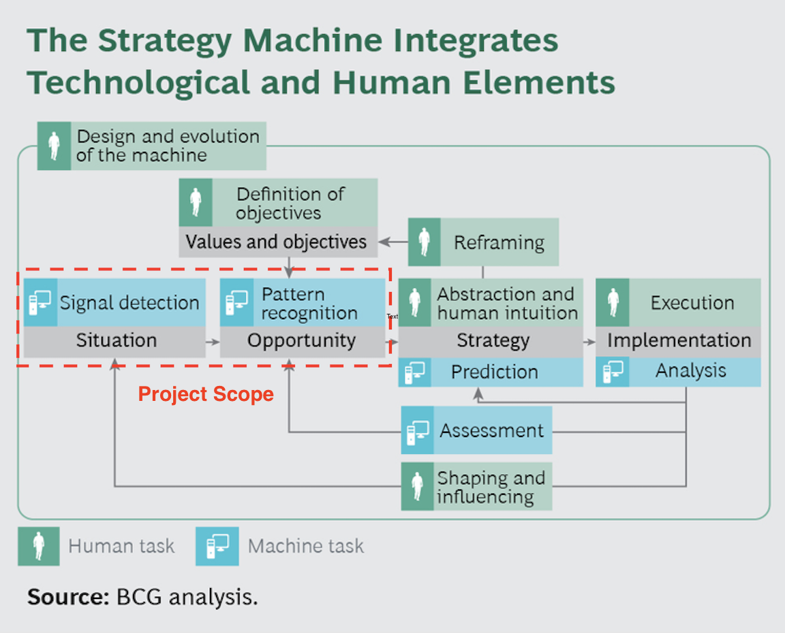

# The Strategy Machine {#strategymachine}

#### Keywords

business strategy, automation, consumer packaged goods, artificial intelligence, natural language processing, visualization

## Better strategies lead to better results

Despite the wide acknowledgement of the value of data and analytics and growing interest in it across all sectors, the consumer packaged goods industry (CPG) still lags other data-driven sectors when it comes to big data implementation and the adoption of real-time, predictive and prescriptive analytics, especially in the strategy development process. Recent focus on relentless cost-cutting has forced CPG companies to reduce headcount while relying on leaner teams to drive higher growth. Teams no longer have the time, resources, or skills to formulate robust business strategies, leading to low performance and further cost cutting. 

The strategy development process in CPG companies often follows a standardized framework with a set of key questions around where to play (market/segment attractiveness), how to win (company/product's right to win), and cost to play (business case). With advances in big data processing and machine intelligence, automating parts of the strategy development process could create significant competitive advantage for lean CPG companies by helping them develop better strategies that lead to better results. 

## Automating the strategy process

The strategy machine aims to automate specific tasks (marked by * below) within each of the key phases of a typical strategy development process: 

**Phase 1: Where to play**

- Market, business and consumer knowledge acquistion*
- Extract market, consumer and competitor insights*
- Forecast and predict future market growth*
- Identify and rank potential growth opportunities*

**Phase 2: How to win**

- Review where to play analyses and refine strategic choices
- Rank strategic choices against company/product's right to win and initial feasibility assessment
- Prioritize growth choices based on weighted set of decision criteria*

**Phase 3: Cost to play**

- Conduct in-depth feasibility assessment
- Develop business plan and financials for strategic choice
- Obtain senior stakeholder alignment and buy-in on final proposal

Let's look at a more specific use case of developing a strategy machine for a company or brand's emerging markets strategy process. By leveraging natural language processing technology, the strategy machine is able to mine vast troves of publicly available relevant emerging market reports and articles. Advanced data integration techniques can then be used to build a proprietary database integrating rich data sources such as The World Bank's Global Consumption database, Economist Intelligence Unit's Country database, Euromonitor's Global Market Research database, and Mintel's Innovation Trends & Insights database (all publicly available or via ischool library access). Finally, through advanced data and predictive analytics, the strategy machine can extract topline analysis and insights around emerging market attractiveness, size-of-prize estimates, country/segment opportunity rankings, competitive insights, and can summarize key recommendations for strategy development onto a "strategy on-a-page" output for executives. This live output can then be used to inform phases 2 & 3 and act as a basis for iteration to refine the business team's assumptions.

## The Future: Human-Machine Strategists

The strategy machine has the potential to automate roughly half of standard strategy tasks, resulting in significantly reduced cycle times and resource requirements. What used to be a time-consuming and human-resource-intensive strategy development process, often delegated to a separate strategy function or outsourced to costly management consultants, will evolve into a critical human-machine integrated process marrying human instincts and expertise with AI-powered self-learning strategy machines. 

That said, the strategy machine should not be viewed as a "strategist in a box" with an end-to-end solution providing all the answers. Instead, it serves to automate the mundane and often time-consuming tasks of the strategy process, namely knowledge acquisition, situation analysis and opportunity identification. At this point, a human-in-the-loop (e.g., business executives, subject matter experts) takes over to iterate and redefine the problem and/or objectives which should lead to more effective and efficient business strategy development and execution. The Boston Consulting Group (BCG) chart below serves as a vision for full human-machine integration in corporate strategy development.

Looking ahead, it is my hope that lean CPG companies will not have to trade off between robust strategy development and limited human resources, which should ultimately drive towards better decisions and results. 

***Resources:***

Reeves, M., Ueda, D., Gerbert, P., Dreischmeier, R. (2014). *The Integrated Strategy Machine: Using AI to Create Advantage. BCG Perspectives.* Retrieved 23 October 2017 from [link](https://www.bcgperspectives.com/content/articles/strategy-technology-digital-integrated-strategy-machine-using-ai-create-advantage/)
